<div align="center">

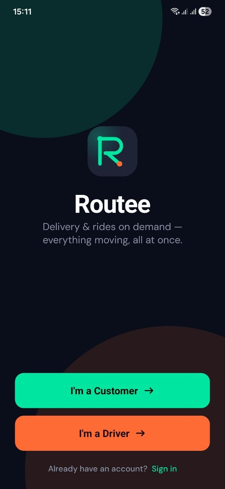

# Routee

**Delivery & rides on demand — everything moving, all at once.**

[](https://reactnative.dev)
[](https://expo.dev)
[](https://typescriptlang.org)
[](https://github.com/pmndrs/zustand)
[](https://docs.swmansion.com/react-native-reanimated)
[](#)

</div>

---

## Overview

Routee is a full-featured ride and delivery mobile app built with React Native and Expo. It supports two distinct user roles — **Customer** and **Driver** — each with a dedicated, tailored experience from sign-in through trip completion.

The app ships with a dark-mode-first design system, real-time map visualization via Leaflet, interactive route planning, vehicle-type selection with live pricing, QR-based delivery handoff, turn-by-turn navigation for drivers, and a full earnings analytics dashboard.

---

## Features

### For Customers
- Interactive map home with nearby driver markers
- Multi-stop route planning with recent address suggestions
- Vehicle type selector — Bike, Car, Van — with fare estimates and ETAs
- Order confirmation sheet with full trip breakdown
- Live order tracking with driver name, rating, plate number, and ETA
- QR code for contactless delivery confirmation
- Full order history with vehicle type, address, price, and status
- User profile with notification settings and language toggle

### For Drivers
- Incoming order alert with a 10-second animated countdown timer
- Turn-by-turn navigation to the pickup point
- Active delivery view with route, distance, and earning summary
- Camera-based QR code scanner for confirming customer handoff
- Earnings dashboard with Day / Week / Month chart and history
- Profile with editable vehicle details (model + license plate)

### General
- Dark-mode-first design system with a consistent token-based theme
- Internationalization via i18next (English / Ukrainian)
- Role-based authentication — Customer or Driver from a single entry point

---

## Tech Stack

| Layer | Technology | Version |
|---|---|---|
| Framework | React Native + Expo | 0.85 / SDK 56 |
| Language | TypeScript | 6.0 |
| Navigation | React Navigation (Stack + Bottom Tabs) | 7 |
| State management | Zustand | 5.0 |
| Animations | React Native Reanimated | 4.3 |
| Maps | Leaflet.js via react-native-webview | — |
| Charts | react-native-chart-kit | 6.12 |
| QR generation | react-native-qrcode-svg | 6.3 |
| QR scanning | expo-camera | SDK 56 |
| i18n | i18next + react-i18next | 26 / 17 |
| Styling | React Native StyleSheet + design tokens | — |

---

## App Flow & Screenshots

### Onboarding

<table>
  <tr>
    <td align="center"><b>Welcome</b></td>
    <td align="center"><b>Sign In</b></td>
  </tr>
  <tr>
    <td align="center">
      
    </td>
    <td align="center">
      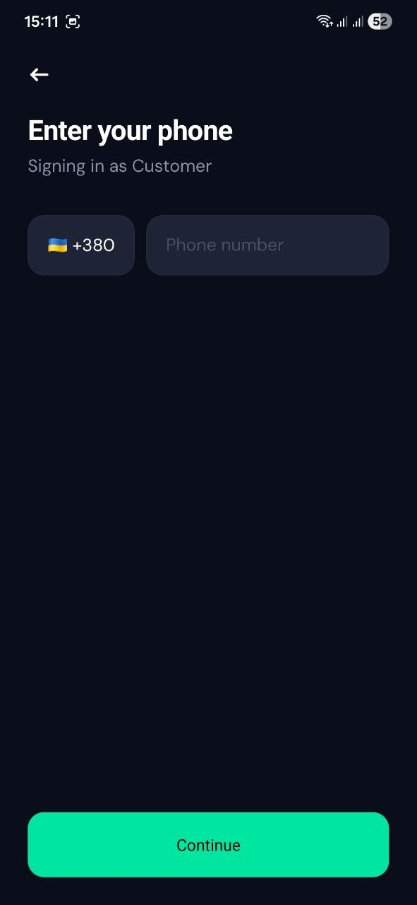
    </td>
  </tr>
  <tr>
    <td align="center">Role selection screen — choose Customer or Driver to get started</td>
    <td align="center">Phone-based authentication with country code picker</td>
  </tr>
</table>

---

### Customer Flow

<table>
  <tr>
    <td align="center"><b>Home Map</b></td>
    <td align="center"><b>Route Planning</b></td>
    <td align="center"><b>Vehicle Selection</b></td>
    <td align="center"><b>Confirm Order</b></td>
  </tr>
  <tr>
    <td align="center">
      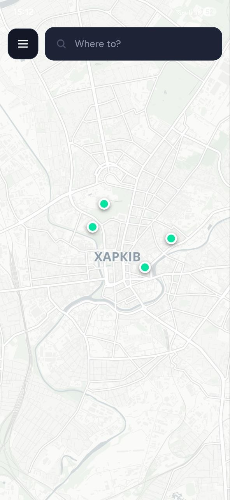
    </td>
    <td align="center">
      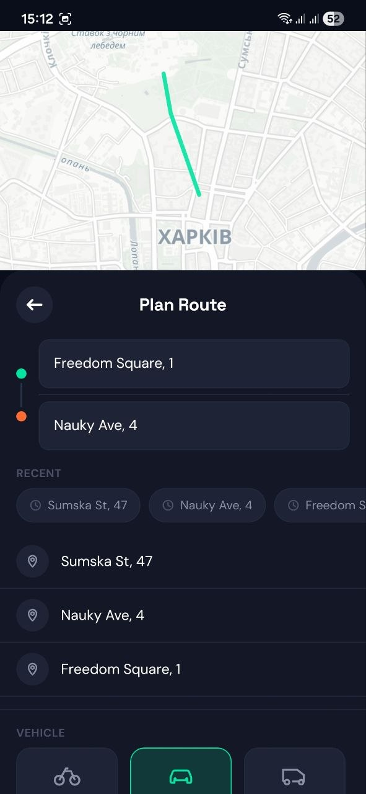
    </td>
    <td align="center">
      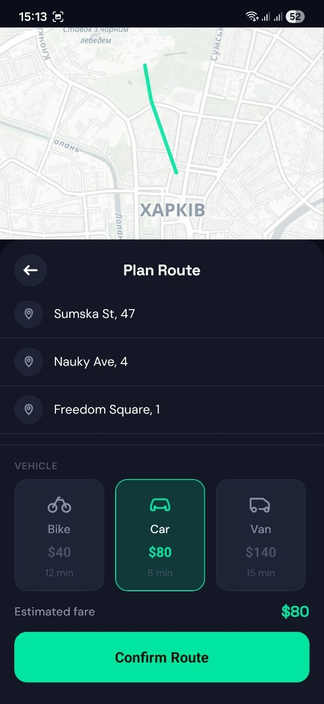
    </td>
    <td align="center">
      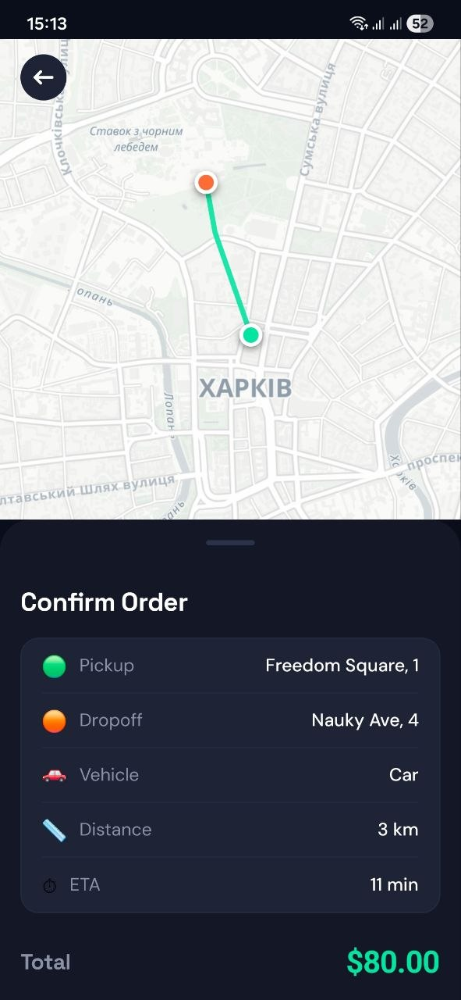
    </td>
  </tr>
  <tr>
    <td align="center">Interactive map with available drivers shown as live markers</td>
    <td align="center">Pickup & dropoff input with recent address suggestions</td>
    <td align="center">Bike / Car / Van with price and ETA per option</td>
    <td align="center">Full order summary — route, vehicle, distance, ETA, total fare</td>
  </tr>
</table>

<table>
  <tr>
    <td align="center"><b>Live Tracking</b></td>
    <td align="center"><b>Delivery QR Code</b></td>
    <td align="center"><b>Order History</b></td>
    <td align="center"><b>Profile</b></td>
  </tr>
  <tr>
    <td align="center">
      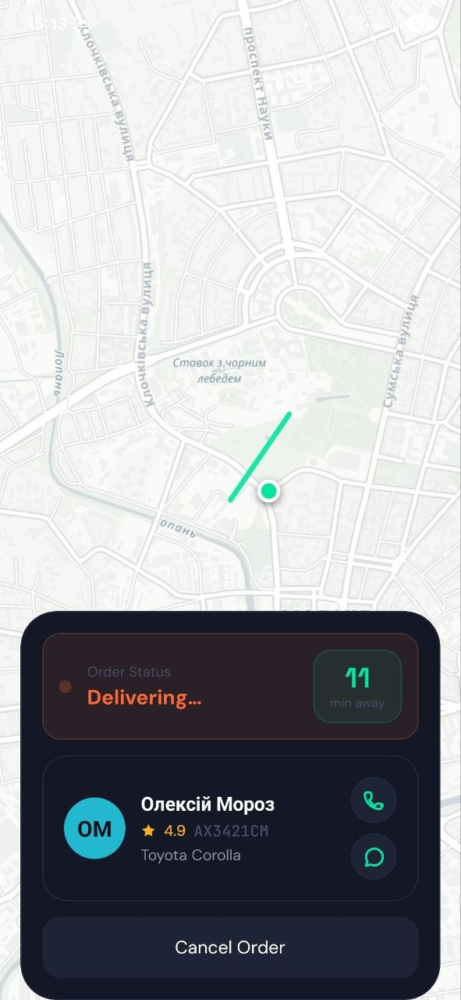
    </td>
    <td align="center">
      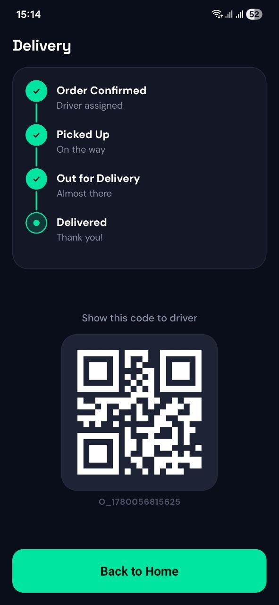
    </td>
    <td align="center">
      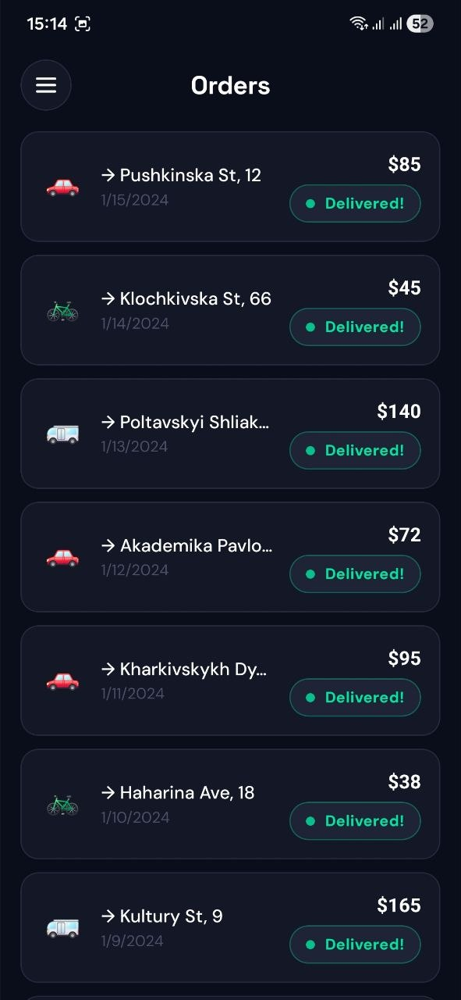
    </td>
    <td align="center">
      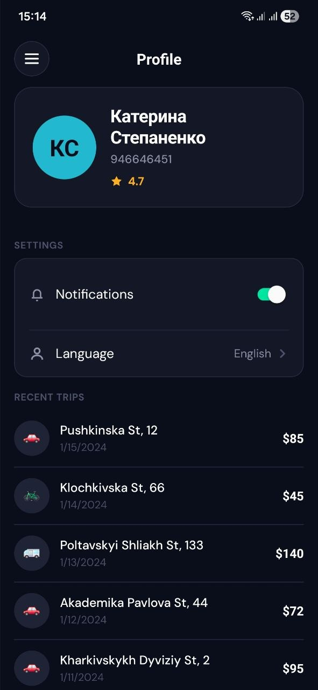
    </td>
  </tr>
  <tr>
    <td align="center">Real-time driver position, name, rating, plate and ETA</td>
    <td align="center">Step-by-step delivery status + QR code shown to driver</td>
    <td align="center">Past deliveries with vehicle type, address, date and price</td>
    <td align="center">User info, notifications, language settings and recent trips</td>
  </tr>
</table>

---

### Driver Flow

<table>
  <tr>
    <td align="center"><b>Incoming Order</b></td>
    <td align="center"><b>Navigation to Pickup</b></td>
    <td align="center"><b>Active Delivery</b></td>
  </tr>
  <tr>
    <td align="center">
      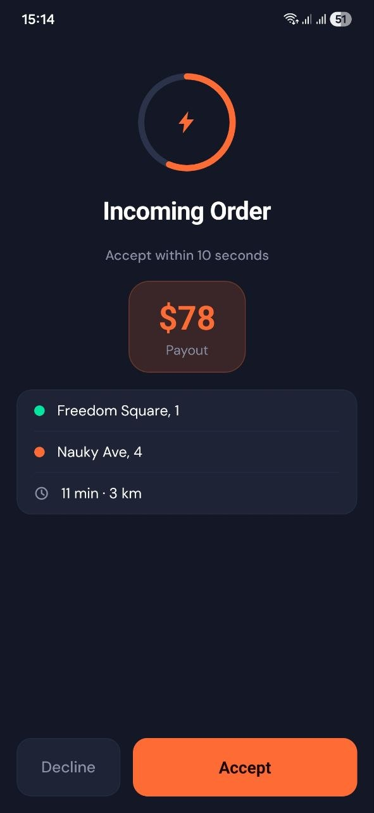
    </td>
    <td align="center">
      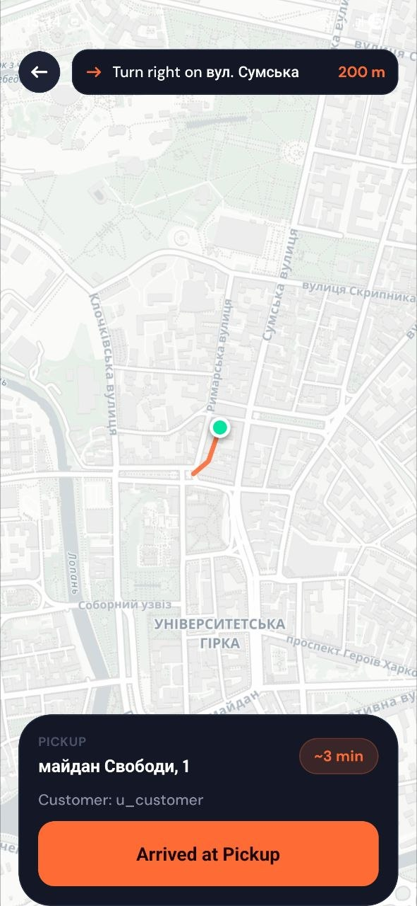
    </td>
    <td align="center">
      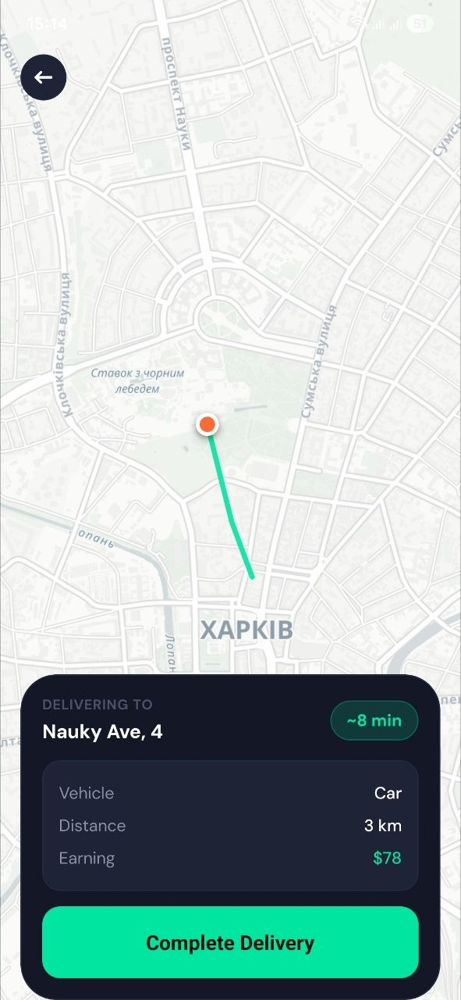
    </td>
  </tr>
  <tr>
    <td align="center">10-second animated countdown with payout, route and Accept / Decline</td>
    <td align="center">Turn-by-turn navigation with route polyline to the pickup address</td>
    <td align="center">Delivery route on map with dropoff address, distance and earnings</td>
  </tr>
</table>

<table>
  <tr>
    <td align="center"><b>QR Code Scanner</b></td>
    <td align="center"><b>Earnings Dashboard</b></td>
    <td align="center"><b>Driver Profile</b></td>
  </tr>
  <tr>
    <td align="center">
      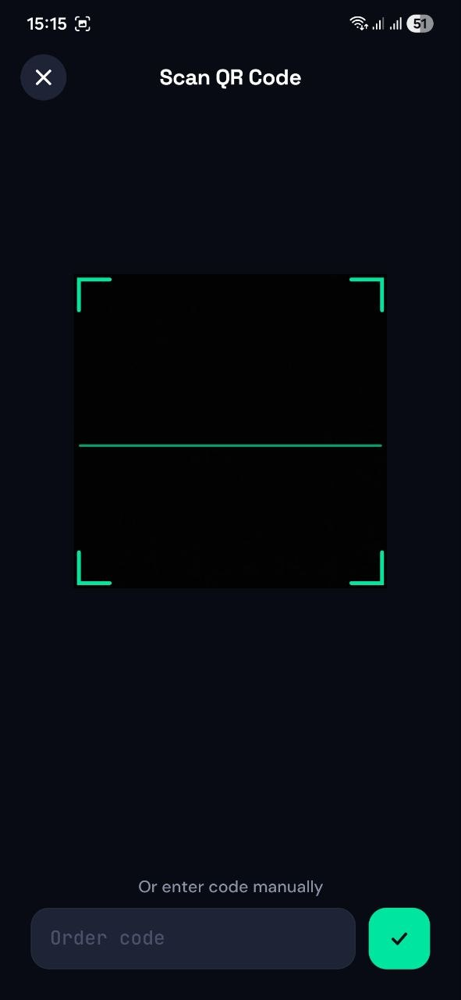
    </td>
    <td align="center">
      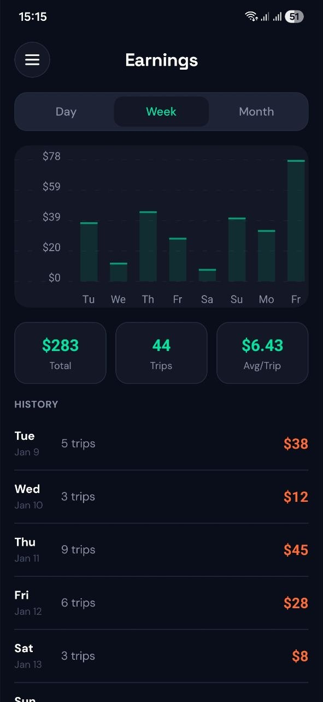
    </td>
    <td align="center">
      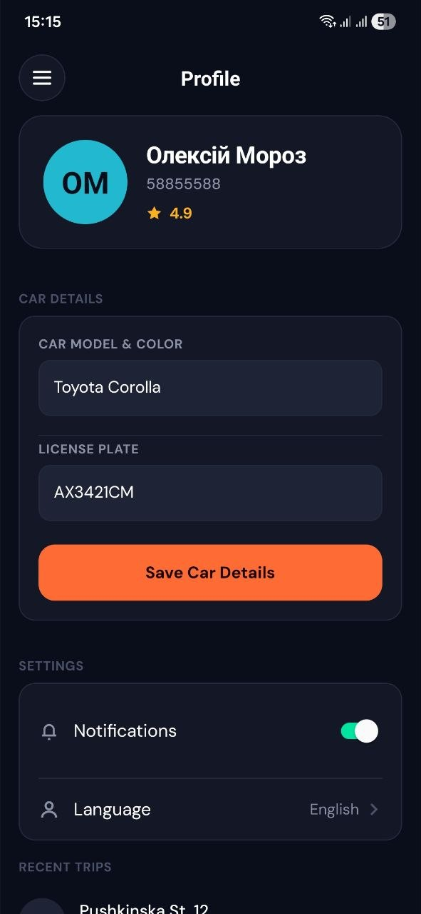
    </td>
  </tr>
  <tr>
    <td align="center">Camera viewfinder for scanning the customer's handoff QR code</td>
    <td align="center">Day / Week / Month earnings with bar chart, trip count and averages</td>
    <td align="center">Driver info, vehicle model, license plate management and trip history</td>
  </tr>
</table>

---

## Project Structure

```
src/
├── components/
│   ├── driver/          # DriverSidebar, EarningsChart, OnlineToggle
│   ├── customer/        # CustomerSidebar
│   ├── map/             # LeafletMap — WebView wrapper for Leaflet.js
│   ├── order/           # IncomingOrderCard, VehicleTypeSelector
│   └── shared/          # CTA, Icons, StatusPill, and other reusables
├── contexts/            # DriverSidebarContext
├── navigation/
│   ├── RootNavigator.tsx   # Root stack — auth gate + role routing
│   ├── DriverTabs.tsx      # Driver bottom tabs + native Modal for orders
│   └── CustomerTabs.tsx    # Customer bottom tabs
├── screens/
│   ├── customer/        # Home, RoutePlanning, OrderConfirm, LiveTracking,
│   │                    #   DeliveryQR, OrdersList
│   ├── driver/          # Dashboard, IncomingOrder, NavigationToPickup,
│   │                    #   ActiveDelivery, QRScan, EarningsSummary
│   └── shared/          # SplashScreen, AuthScreen, ProfileScreen
├── store/
│   ├── authStore.ts     # Authentication state
│   └── driverStore.ts   # Online status, current/incoming order, earnings
├── constants/
│   └── translations/    # en.json, uk.json
├── theme/               # Colors, Fonts, Spacing, Radius — design tokens
├── types/               # Shared TypeScript interfaces (Order, User, etc.)
└── i18n.ts              # i18next initialisation
```

---

## Getting Started

### Prerequisites

- Node.js 18+
- Expo CLI — `npm install -g expo-cli`
- Android Studio or Xcode for native device/emulator builds

### Install & Run

```bash
# Install dependencies
npm install

# Start Expo dev server
npm start

# Run on Android emulator / device
npm run android

# Run on iOS simulator / device
npm run ios

# Run in the browser
npm run web
```

---

## Architecture Notes

**State management** — All application state lives in Zustand stores. The driver's incoming order flow is fully reactive: the store sets `incomingOrder`, and the UI responds automatically without imperative navigation calls.

**Maps** — `LeafletMap` is a `react-native-webview` wrapper around Leaflet.js + OpenStreetMap tiles. This avoids native SDK setup complexity while delivering a fully interactive map on all three platforms (Android, iOS, Web).

**Incoming order modal** — The order alert uses React Native's native `<Modal animationType="slide">` rather than a navigation stack screen. This keeps the animation on the native thread, fully isolated from JS workload, ensuring a flicker-free slide-up on every device.

**Theming** — All visual values — colours, font scales, spacing steps, border radii — are exported from a single `src/theme/tokens.ts` file. No magic numbers anywhere in the component tree.

**i18n** — i18next is initialised at app startup. Every user-facing string goes through `t()`, making it straightforward to add new locales.

---

<div align="center">
  <sub>Built with React Native & Expo · Dark-mode first · Dual-role architecture</sub>
</div>
